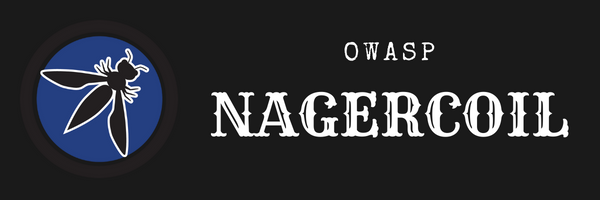

---

layout: col-sidebar
title: OWASP Nagercoi
tags: Nagercoil OWASP Chapter India
level: 2
region: Asia
meetup-group: Nagercoil-OWASP-Meetup-Group

---

## Welcome

In October 2022, OWASP Nagercoil was established. Our Nagercoil Chapter has various Meetups and Webinars scheduled for the upcoming days. All of these gatherings are open to the public, and anyone is welcome to attend and offer their expertise in the field of security. The security community and our chapter work together to develop secure application development projects and network strategies.

## Participation
Keep watching this space for announcements about upcoming events. Everyone is welcome to join us at our chapter meetings. For more detailed information about the OWASP Mugla University Student Chapter, contact the chapter leaders: 
* [Austin](mailto:austin.francis@owasp.org)

Next Meeting/Event 
---------------------

We schedule our meetings on the [OWASP Nagercoil Meetup Group] [Meetup Group](https://www.meetup.com/nagercoil-owasp-meetup-group)



Our meetings are open to the public, and you do not need to be a member to attend. Please do consider [joining OWASP](https://owasp.org/membership/) if you find our community, projects, and meetings valuable, or sponsoring this chapter.

## Speakers
Would you like to speak on the upcoming OWASP Nagercoil Webinar? [Contact Us](mailto:austin.francis@owasp.org)

**Email Format :**

- Speaker name
- Job Role
- Company / Organization
- Country
- Email ID
- Contact Number
- Speaker Profile
- Presentation Details
    - Name / Title of the Presentation
    - Abstract of the presentation
    - Presentation time required

## Local News
- Meeting Location
- Everyone is welcome to join us at our chapter meetings.
